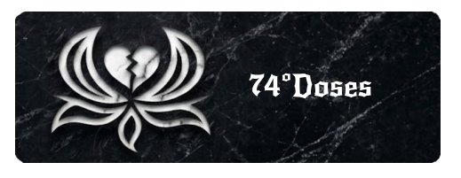
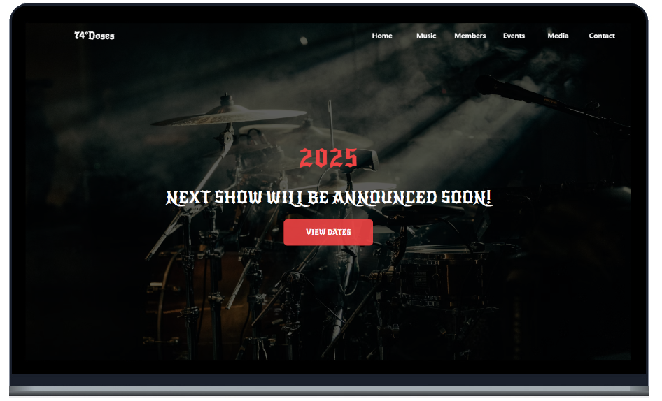

<h1 align="center">
  
</h1>

  <a href="#-tecnologias">Tecnologias</a>&nbsp;&nbsp;&nbsp;|&nbsp;&nbsp;&nbsp;
  <a href="#-projeto">Projeto</a>&nbsp;&nbsp;&nbsp;|&nbsp;&nbsp;&nbsp;
  <a href="#-layout">Layout</a>&nbsp;&nbsp;&nbsp;|&nbsp;&nbsp;&nbsp;
  <a href="#%EF%B8%8F-gerenciamento">Gerenciamento</a>&nbsp;&nbsp;&nbsp;

  <a href="#-como-executar">Como executar</a>&nbsp;&nbsp;&nbsp;|&nbsp;&nbsp;&nbsp;
  <a href="#-licença">Licença</a>

  
  

 

  

## ✨ Tecnologias

Esse projeto foi desenvolvido com as seguintes tecnologias:

- [Git](https://git-scm.com/)
- [React](https://react.dev/)
- [Vite](https://vitejs.dev/)
- [TailWind](https://tailwindcss.com/)
- [HTML5](https://developer.mozilla.org/pt-BR/docs/Web/HTML)
- [Yarn](https://yarnpkg.com/)
- [Javascript](https://www.typescriptlang.org/)
- [TypeScript](https://www.typescriptlang.org/)
- [Axios](https://axios-http.com/)
- [NestJS](https://nestjs.com/)
- [JWT](https://jwt.io/)
- [PostgreSQL](https://www.postgresql.org/)
- [i18next](https://www.i18next.com/)
- [Font Awesome](https://fontawesome.com/)

## 💻 Projeto

O **74doses** é um site dedicado a apresentar uma das bandas mais populares da atualidade. Seu objetivo é divulgar o trabalho do grupo, fortalecer sua presença digital e aproximar fãs e novos públicos por meio de informações, conteúdos e uma experiência envolvente.

## 🔖 Layout

Você pode visualizar a inspiração do projeto na pasta **prototipagem** disponível no próprio repositório, onde estão os protótipos que serviram como base para o desenvolvimento da interface.

## 🗃️ Gerenciamento

Você pode visualizar o gerenciamento/progresso do projeto através da pasta _Gerenciamento.

## 🚀 Como executar

- <b>Clone o repositório</b>
- <b>FrontEnd</b> ⇝ Instale as dependências com: `yarn install`
- <b>FrontEnd</b> ⇝ Inicie o servidor com: `yarn run server`

Agora você pode acessar [`localhost:5173`](http://localhost:5173) do seu navegador.

## 📄 Licença

Esse projeto está sob a licença MIT. Veja o arquivo [LICENSE](LICENSE.md) para mais detalhes.

---

Feito com ♥ by WellingtonPLF 👋🏻 [Contact Me 😊](https://mail.google.com/mail/?view=cm&fs=1&to=wellplf@gmail.com)